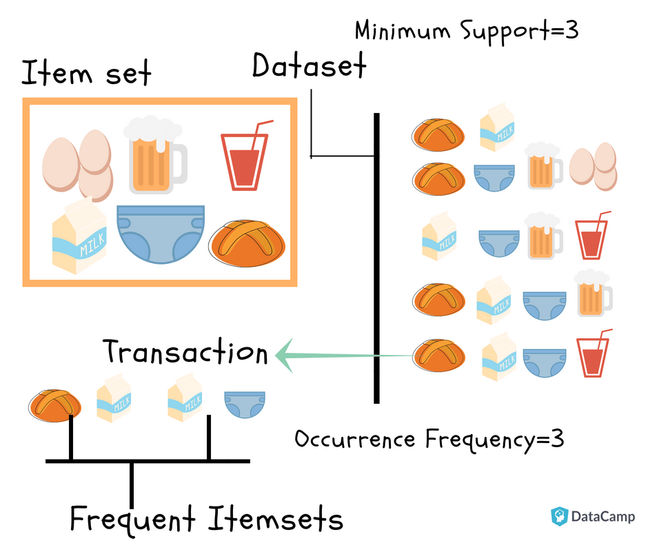

# Market-Basket-Analysis-in-SQL
### This shows how to create a market Basket Analysis in SQL

### What is Market Basket Analysis?

Market basket analysis helps a retailer to know what customers often purchase together, and hence, knowing what to put up for promotion when need be. Putting two items that are mostly purchased together on promotion at the same time would not create a significant increase in revenue, while a promotion involving just one of the items would likely drive sales of the other. Market basket analysis may provide the retailer with information to understand the purchase behavior of a buyer. This information will enable the retailer to understand the buyer's needs and rewrite the store's layout accordingly, develop cross-promotional programs, or even capture new buyers (much like the cross-selling concept).




```sql
USE adventureworks2019

go

WITH order_item
     AS (SELECT DISTINCT a.customerkey,
                         a.orderdatekey,
                         a.productkey,
                         b.englishproductname AS ProductName
         FROM   [AdventureWorksDW2019].[dbo].[factinternetsales] a
                INNER JOIN [AdventureWorksDW2019].[dbo].[dimproduct] b
                        ON a.productkey = b.productkey)
SELECT c.productname,
       d.productname,
       Count(*) frequency
FROM   order_item c
       INNER JOIN order_item d
               ON c.customerkey = d.customerkey
                  AND c.orderdatekey = d.orderdatekey
WHERE  c.productname < d.productname
GROUP  BY c.productname,
          d.productname
ORDER  BY Count(*) DESC
```
